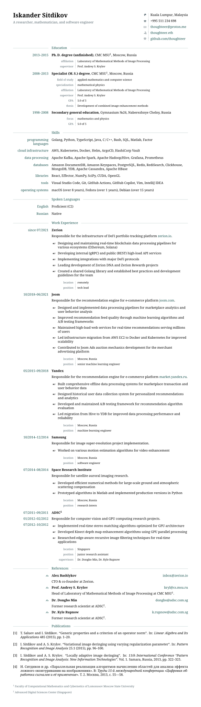

# CV

[An unsophisticated yet neatly crafted LaTeX template for your CV.](#example)

## License

This CV template is released under the MIT license.

## Usage

[Docker](https://docs.docker.com/install/) is all you need.

Clone the repo, edit `cv.tex` and `publications.bib` (if any), then run
```bash
$ ./make.sh
```
This will produce `cv.pdf`.

You can change the target language by passing an additional argument as in
```bash
$ ./make.sh language=russian
```
The default language is `english`.

To clean up after compilation, run
```bash
$ ./make.sh clean
```
Note that this will also remove the PDF.

## Customization

#### Color scheme

Just redefine colors in the *Colors* section of `cv.cls`.

#### Additional LaTeX packages

Add missing Debian packages to the `Dockerfile` file, then run
```bash
docker build -t thoughteer/cv .
```

## Example


